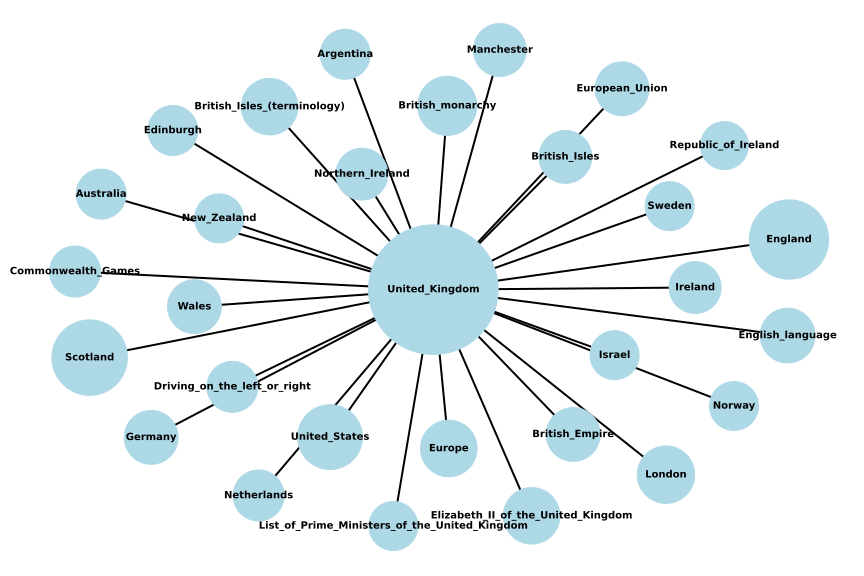

----------------

Nowadays, clichés play a significant role in shaping our view of the world. For instance, when one considers France, there is a tendency to connect it with emblematic symbols such as the Eiffel Tower, cheese, wine or even cigarettes. Similarly, when thinking about the sun, it’s common to associate it directly with certain countries, such as Costa Rica or Mexico. Whereas these associations accurately reflect reality is a matter of debate. Nevertheless, a question may arise - **How do these clichés shape our processes of thought?**

Using the Wikispeedia dataset, our objective is to analyse the impact of clichés in our research process, with a primary emphasis on those associated with different countries. The dataset provides all the paths of the players, finished and unfinished, allowing us to establish whether they rely on common ideas or concepts to navigate through the pages. In this case, clichés manifest in the form of Wikipedia’s article or categories of these articles.

In understanding real-world networks, it is crucial to recognize the specific way in which they are connected. Wikipedia, being a representative of a similar network, is made of hyperlinks that contain many short-range, and few long-range, connections. This specific semantic space is perceived by humans, and Wikispeedia, as a game, becomes particularly interesting in tackling the small world property. Through our exploration, we will specifically consider how our notion of clichés aids us in navigating through the hyperlinks. **One may wonder if clichés help us navigate through the game.**

----------------

## *What do we have ?*

The dataset is composed of diverse articles and categories, forming the basis of analysis on clichés related to countries. This may raise the question of their substantial representation in the dataset. Indeed, among the top fifty most visited articles in finished paths, eleven are centred around countries, highlighting a recurrent theme in the dataset. Notably, the United-States of America emerges as the most visited article with 8654 occurrences. 

<!-- add the plot top_50_visited_articles.html -->

<iframe src="assets/plot/top_50_visited_articles.html" width="750px" height="530px" frameborder="0" position="relative">Top 50 visited articles</iframe>

Furthermore, in the top fifty, there are in total 22'836 occurrences of countries in finished paths, which confirm a high presence of countries' articles in the games that are succeeded.

If we take the example of the United Kingdom, which occurred 3806 times, we see that its position varies in finished games with a predominance at the end of paths.

<iframe src="assets/plot/Percentage_Pos_UK_Path.html" width="750px" height="530px" frameborder="0" position="relative">Top 50 visited articles</iframe>

Great! We have enough countries' data to go on with our analysis!

<!-- add the assest/img/HOMERRRRR.jpg -->

  

----------------

## *And is there any abnormal result that could be analysed in the scope of our subject?*

Before diving more into the analysis of the impact of clichés on our data, let’s see if there is any particularity in the data that could be explored through the point of view of the clichés. 

For this, the distribution of the length and the duration of the path have been observed and both measures present expected plots. 

<iframe src="assets/plot/Path_length_vs_duration.html" width="750px" height="530px" frameborder="0" position="relative">Top 50 visited articles</iframe>

The relationship between the length of the path and the rating given by the player followed an increasing linear relationship, whether considering the path length or the difference in length from the theoretical shortest path. Obtaining a more significant result with the difference in length, we will choose it as our performance metric.

<iframe src="assets/plot/length_difference_rating.html" width="750px" height="530px" frameborder="0" position="relative">Top 50 visited articles</iframe>

**_Everything seems “normal”._**

----------------

## *But what is a cliché and how can we find them?*

In this context, when we refer to clichés, we are addressing stereotypes – commonly held ideas and concepts that rapidly come to mind when thinking about a particular subject.

Various approaches were considered to establish clichés associated with a specific country. Initially, manual selection was contemplated, but this posed a risk of significant bias as it relied solely on the perspectives of five individuals.

An alternative method involves using artificial intelligence, such as Chat-GPT, to generate clichés associated with a particular nationality and/or country. In order to accomplish this, we asked four distinct questions as an illustration, using the example of the United Kingdom: _“What are the most common clichés about the UK?”_, _“Name ten stereotypes commonly associated with the UK”_, _“What are common stereotypes about UK people?”_ and _“Name ten clichés about British people”_. Here is an example of the ten clichés we obtained when asking the first question:

<i> “Tea-drinking; Politeness; Royalty and the Queen; Red buses and phone booths in London; Bad weather; Accent stereotypes; Fish and Chips; Reserved behaviour; Love for football (soccer); Historical references.” </i>

Hence, this method gave us various clichés, but we still have to be careful and manually check in case it encoded standard bias or noise.

Rather than using Chat-GPT, one could browse through the internet to find clichés, by for example looking into Wikipedia’s pages such as _Stereotypes of British people_. Nevertheless, this method does not permit to make the procedure stable and efficient enough.

The last option explored data augmentation – a different data set was used to link clichés with articles and/or categories. This process involved text analysis and particularly topic detection, proper nouns and shared hyperlinks. 

----------------

## *But how can we explore them ?*

We explored clichés through two different measures: statistics and categories.
The articles are defined, amongst other, by categories. It could be interesting to see how often categories from clichés occur in the path containing our subject of interest: _United_Kingdom_. Are some types of cliché articles more present than others? Do their categories match the ones from _United_Kingdom_ or not at all? 

The results are not very conclusive… Is it the end? ☹

The analysis done previously did not show any result that could represent a sign of influence of the clichés on our way of playing the game. However, we believe that common thinking is usually led by predefined ideas of concept, here of a place: the United Kingdom. So why is it so?

We asked ourselves the question and thought about it in greater depth. We raised three hypotheses:
* The clichés do not really have an influence on the path;
* The data and the scope of the game do not allow us to find “significant results” as the paths are usually small and there is no hyperlink; 
* Our set of clichés is not great enough, so we use data augmentation, as specified above.

----------------

## *How could we augment our data?*

For the data augmentation, we explored several ways of extracting clichés.

In this scope, we looked at different ways to connect the articles and the reference article _United_Kingdom_. We have selected different measures:
* Common topics 
* Similar proper nouns in the text
* Common hyperlinks

<ol>
<li>For the topics, we proceeded using Tokenization. This process allowed us to break the text into small chunks, words that we then categorised under different topics using packages such as nltk, spacy, empath and gensim. As these tokens can contain non-meaningful words such as “a”, “at”, etc. we decided to further filter them using stop words removal.

This analysis did not give us any “good” results. In fact, our process of categorisation into different topics gave us fairly general genres that were found in most of the articles.

 
<table>
    <tr>
        <th>article_name</th>
        <th>common_topics</th>
    </tr>
    <tr>
        <td>12th_century</td>
        <td>{&#39;money&#39;, &#39;wedding&#39;, &#39;royalty&#39;, &#39;dance&#39;, &#39;medieval&#39;, &#39;office&#39;, &#39;power&#39;, &#39;help&#39;}</td>
    </tr>
    <tr>
        <td>Armand_Jean_du_Plessis%2C_Cardinal_Richelieu</td>
        <td>{&#39;money&#39;, &#39;wedding&#39;, &#39;royalty&#39;, &#39;dance&#39;, &#39;medieval&#39;, &#39;office&#39;, &#39;power&#39;, &#39;help&#39;}</td>
    </tr>
    <tr>
        <td>Babylonia</td>
        <td>{&#39;money&#39;, &#39;wedding&#39;, &#39;royalty&#39;, &#39;dance&#39;, &#39;medieval&#39;, &#39;office&#39;, &#39;power&#39;, &#39;help&#39;}</td>
    </tr>
</table>
 

The attached table shows three items which, as far as people generally know, have little in common. However, we can see that these items have a lot of topics in common that would not come to mind when the subject in question is mentioned. 

More in-depth text analysis and a more precise and detailed categorisation could perhaps have given us better results.

However, given our level of knowledge of text analysis, we decided to turn to another way of approaching the text: proper nouns.
</li>

<li>Indeed, proper nouns seemed to be a good alternative as they generally represent a good indication of the subjects covered in a text, whether they be names of countries, people, and so on.

To do this, we again used tokens, but in addition we used a natural language processing feature that allows us to assign each word its function in the sentence. 

Note that this feature has a few limitations, particularly when it comes to common nouns, which end up as the subject and head of the sentence. This is probably due to the fact that this is a basic analysis. We will keep these limitations in mind for future analysis. Given the limitations, this result alone also did not give us satisfactory results.

 
<table>
    <tr>
        <th>article_name</th>
        <th>common_propnouns</th>
    </tr>
    <tr>
        <td>United_Kingdom_national_football_team</td>
        <td>{&#39;Northern&#39;, &#39;Ireland&#39;, &#39;United&#39;, &#39;England&#39;, &#39;Kingdom&#39;, &#39;Scotland&#39;, &#39;UK&#39;}</td>
    </tr>
    <tr>
        <td>Pound_sterling</td>
        <td>{&#39;Northern&#39;, &#39;Ireland&#39;, &#39;United&#39;, &#39;England&#39;, &#39;Kingdom&#39;, &#39;Scotland&#39;, &#39;UK&#39;}</td>
    </tr>
    <tr>
        <td>Great_Britain</td>
        <td>{&#39;Northern&#39;, &#39;Ireland&#39;, &#39;United&#39;, &#39;England&#39;, &#39;Kingdom&#39;, &#39;Scotland&#39;, &#39;British&#39;}</td>
    </tr>
    <tr>
        <td>England</td>
        <td>{&#39;United&#39;, &#39;England&#39;, &#39;Kingdom&#39;, &#39;Scotland&#39;, &#39;London&#39;, &#39;UK&#39;}</td>
    </tr>
    <tr>
        <td>British_Isles</td>
        <td>{&#39;Ireland&#39;, &#39;United&#39;, &#39;England&#39;, &#39;Kingdom&#39;, &#39;Scotland&#39;, &#39;British&#39;}</td>
    </tr>
</table>
 

In the table above, we can see common proper nouns between five distinct articles and the United Kingdom. The obtained proper nouns do not give us much more information, since they are logical relations between the given article and the United Kingdom.</li>

<li>Finally, we turned to a part of the data that we had not yet explored: hyperlinks. In fact, this is data that could enable us to take a more realistic approach to data augmentation. The game is based on moving from one article to another via hyperlinks. So whatever idea the player has in mind, they will inevitably be limited by the presence or absence of hyperlinks on a given article.

To do this, we compared the number of hyperlinks between our article of interest and the articles in question. 

 
<table>
    <tr>
        <th>article_name</th>
        <th>common_links</th>
        <th>nbr_common_links</th>
    </tr>
    <tr>
        <td>Jesus</td>
        <td>[&#39;English_language&#39;, &#39;Europe&#39;, &#39;British_Empire&#39;, &#39;Christianity&#39;, &#39;Islam&#39;, &#39;Judaism&#39;, &#39;Hinduism&#39;]</td>
        <td style="text-align: right">7</td>
    </tr>
    <tr>
        <td>Paul_McCartney</td>
        <td>[&#39;London&#39;, &#39;Elizabeth_II_of_the_United_Kingdom&#39;, &#39;Television&#39;, &#39;Ireland&#39;, &#39;The_Beatles&#39;, &#39;Republic_of_Ireland&#39;, &#39;Bertrand_Russell&#39;, &#39;William_Shakespeare&#39;, &#39;Northern_Ireland&#39;, &#39;Scotland&#39;, &#39;Germany&#39;, &#39;England&#39;, &#39;Buckingham_Palace&#39;]</td>
        <td style="text-align: right">13</td>
    </tr>
    <tr>
        <td>Mario</td>
        <td>[&#39;Football_(soccer)&#39;, &#39;Television&#39;, &#39;English_language&#39;, &#39;Opera&#39;]</td>
        <td style="text-align: right">4</td>
    </tr>
</table>

This table, in contrast to the other two, seems to give results that are more consistent with what we would expect from clichés (in the context of our definition of this term). The more links there are in common, the more the article relates to the United Kingdom and the more likely it is to be considered a cliché.</li>
 </ol>

In the following graph, we can see how each article relates to the United_Kingdom through the number of common links. The bigger the node, the more links they have in common. But your keen eye will have noticed that a lot of “big” nodes are actually countries: England, Scotland, the United States, Northern Ireland etc. and although perhaps closely related, including countries in our selection of clichés would disproportionately augment our data. Additionally, countries are arguably always related in some (thin perhaps) way but do not necessarily represent a cliché, e.g. Argentina. In this sense, we have decided to get rid of all articles selected in the clichés that were countries or geographical entities.

<figure>
  
    <figcaption>Common links between the articles and the United Kingdom</figcaption>
</figure>

----------------

## *What did we obtain?*

Now that we have managed to increase our data of clichés, we are going to evaluate their impact on performance in the Wikispeedia game. To do this, we isolate all the finished paths of players who pass through United_Kingdom and also through at least one item defined as a cliché. We also take the complementary dataset of paths that do not include a cliché article. This will allow us to compare the two performances by looking at a given rating. Indeed, as seen previously, rating seems to have an influence on the difference of length in paths. Comparing the difference in length for two ratings would not make much sense in this way.

The result is evaluated by performing a t-test on the difference between the path length and the theoretical shortest path. Under the null hypothesis that if we pass through clichés the path is shorter, we obtained a p-value strictly less than 0.05. Hence, we reject our null-hypothesis.

We could argue that our text analysis was fairly basic. We therefore feel that a more in-depth analysis would be necessary in order to truly conclude that clichés have no influence if this is the case. In future work, we will therefore need to carry out more advanced investigations by combining the approaches described above and selecting the words in greater detail.

----------------

 

## *Conclusion*

By examining the United Kingdom as an example, we identified various clichés within our data set using various methods and analysed their influence on game performances in different ways. Despite our rigorous analysis and diverse methodologies, the results yielded no significant impact of clichés on winning the game. Further research and data collection may be necessary to confirm our hypothesis or cover additional factors that contribute to winning the game. 

… Right then, time for tea ! ☕

  

